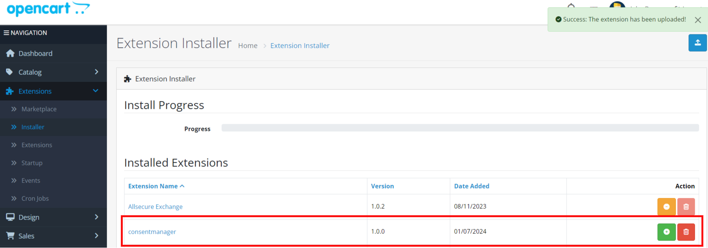
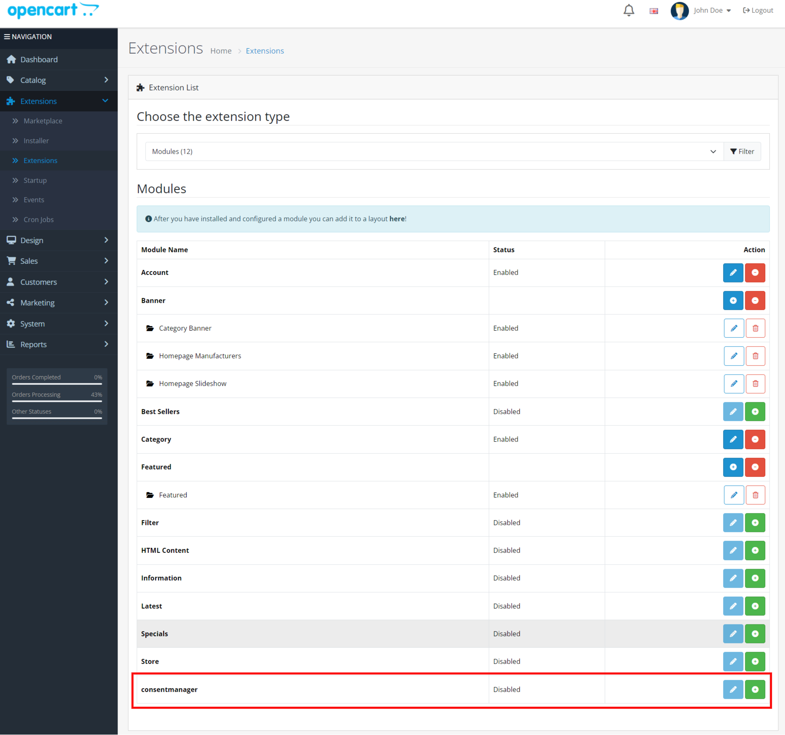
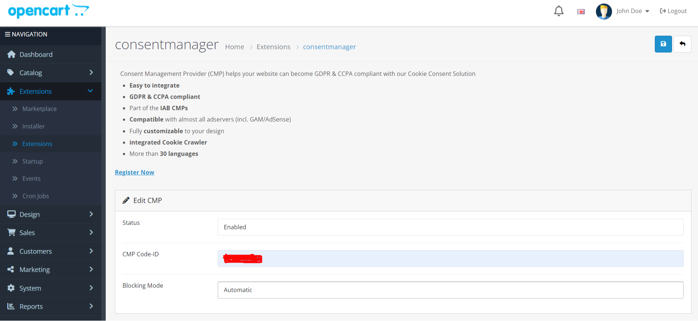
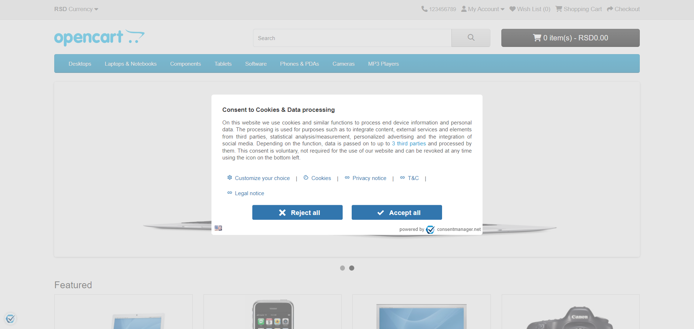

# ConsentManager.net

## Installing

== Method 1: ==
1. Download the latest released packaged from (https://github.com/iubenda/cm-plugin-opencart4/releases) with extension as .ocmod.zip
2. Log in to admin
3. Navigate to Extensions => Installer
4. Browser your package and click upload button.
5. After uploaded, you can see the ConsentManager in the uploaded list.
6. Click green colored + icon to install the extension (Actually it will not install the extension, it will move the temporarily above uploaded packaged files to the under path/to/project/extension/consentmanager/

== Method 2: ==

1. Download the latest released packaged from (https://github.com/iubenda/cm-plugin-opencart4/releases)
2. Unzip the package.
3. And upload the files to under path/to/project/extension/consentmanager/ folder via FTP.
4. This package not overwriting any core files.

== Install ==

1. If you followed either Method 1 or Method 2, you need to navigate Extensions => Extensions
2. Choose the Extension type as 'Modules'
3. Scroll down to locate the 'consentmanager' extension.
4. Click green colored + icon to install the extension.

## Upgradation

1. Download the latest released packaged from (https://github.com/iubenda/cm-plugin-opencart4/releases)
2. Unzip the package.
3. And upload the files to under path/to/project/extension/consentmanager/ folder via FTP.
4. This would overwrite/replace the old extension files.

## Configuration

1. Navigate Extensions => Extensions
2. Choose the Extension type as 'Modules'
3. Scroll down to locate the 'consentmanager' extension.
4. Click blue colored pencil icon to edit the extension.
5. Enter CMP ID, you get this from consentmanager.net
6. Select the Mode: Automatic or Semi-Automatic

## Using

1. Go to shop frontend to view consentmanager.net in place.

## Changelog

= 1.0.0 =
* Initial release.
* Tested on 4.0.2.3
* 01 Jul, 2024